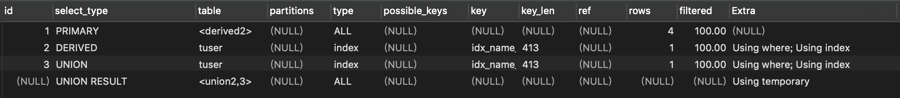

# mysql索引

# 说明
- **帮助mysql高效获取数据的数据结构**
   - 方便查找 ---检索
   - 索引查询内容 ---覆盖索引
- **一般来说索引本身也很大，不可能全部存储在内存中，因此索引往往是存储在磁盘上的文件中的**
- **索引包括：聚集索引、覆盖索引、前缀索引、唯一索引**

- **索引的优点：**
  1. 被索引的列会自动进行排序，包括单列索引和组合索引，只是组合索引的排序要复杂一些
  2. 如果按照索引的顺序进行排序，对应order by语句来说，效率会提高很多
  3. where索引列在存储引擎层处理
  4. 覆盖索引，不需要回表查询

- **索引的缺点：**
  1. 会占用磁盘空间
  2. 虽然会提高查询效率，但是会降低更新表的效率。每次对表进行增删改操作，mysql不仅要保存数据，也要保持或者更新对应的索引文件

- **索引分类**
  - 单列索引
    1. 普通索引：允许在定义索引的列中插入重复值和空值，只是为了查询数据更快一些。add index
    2. 唯一索引：索引列中的值必须是唯一的，但是允许为空值。add unique index
    3.主键索引：是一种特殊的索引，不允许有空值。pk
  - 组合索引
    1. 在表中的多个字段组合上创建的索引 add index(col1,col2,..)
    2. 组合索引的使用，需要遵循最左前缀原则
    3. 一般情况下，建议使用组合索引替代单列索引（主键索引除外）
  - 全文索引
    1. 只有在MYISAM引擎、InnoDB(5.6以后)上才能使用，而且只能在CHAR、VARCHAR、TEXT类型字段上使用全文索引。fulltext
    2. 优先级最高，先执行，不会执行其他索引
    3.存储引擎决定执行一个索引
  - 空间索引
    1. 待完善

- **索引的使用：**
  - 创建索引
    1. 单列索引之普通索引
    
        ```sql
        create index index_name on table(column(length));
        alter table table_name add index index_name(column(length))
        ```

    2. 单列索引之唯一索引
    
        ```sql
        create unique index index_name on table(column(length))
        alter table table_name add unique index index_name(column(length))
        ```
       
    3. 单列索引之全文索引
        ```sql
        create fulltext index index_name on table(column(length))
        alter table table_name add fulltext index_name(column)
        ```    

    4. 组合索引
        ```sql
        alter table table_name add index index_aaa_bbb (aaa(50),bbb(10))
        ```
    
  - 删除索引
    ```sql
    drop index index_name on table
    ```

  - 查看索引
    ```sql
    show index from table _name
    ```

